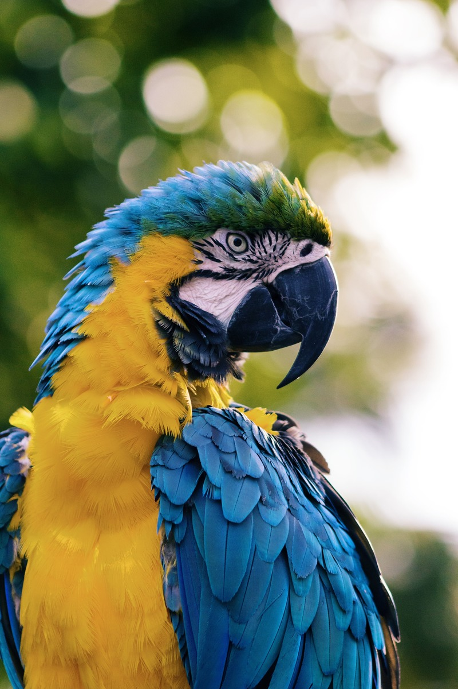

# Black & White : Troposphere + Lambda + Sharp

Playing with **Trophosphere**, **Lambda** and **Sharp** to convert an color image from to black and white version.

### Exemple

### Thanks

Photo by [Andrew Pons](https://unsplash.com/@imandrewpons) on [Unsplash](https://unsplash.com/photos/lylCw4zcA7I)
